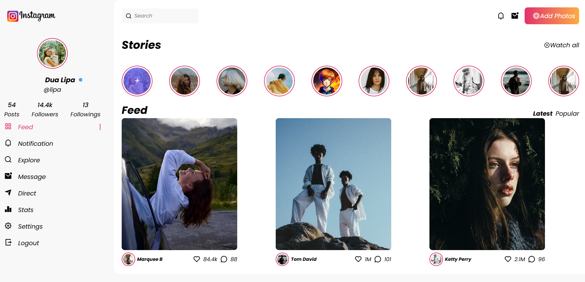

## 🌟 Project Overview
This project is a responsive Instagram-inspired web application created to enhance frontend development skills, focusing on HTML and CSS design techniques.

## 🖼️ Project Screenshots


## ✨ Features
- Responsive sidebar navigation
- User profile section
- Stories carousel
- Feed layout with post interactions
- Modern, clean UI design

## 🛠️ Technologies Used
- HTML5
- CSS3
- Remix Icons

## 🎯 Learning Outcomes

### HTML Structure
- Semantic HTML structure
- Nested component design
- Responsive layout principles

### CSS Techniques
- Flexbox and Grid layouts
- Responsive design
- Advanced styling techniques
- Icon integration
- Color and typography management

### Key Skills Developed
- Frontend component creation
- UI/UX design implementation
- Cross-device compatibility
- Modern web design practices

## 🚀 Project Setup

### Clone the Repository
```bash
git clone https://github.com/yourusername/instagram-clone.git
cd instagram-clone
